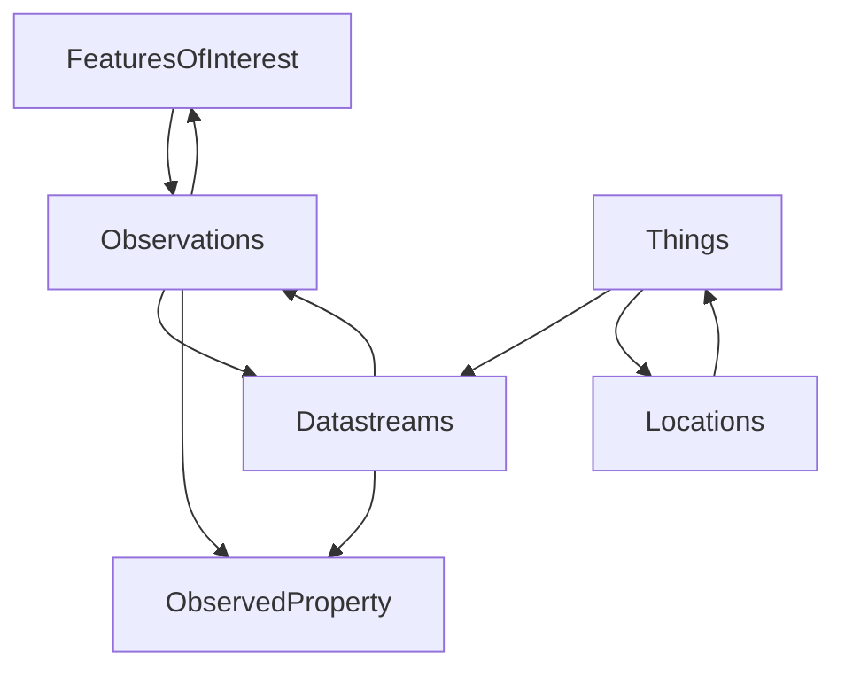

# GeoSense
A simple web app for exploring British Geological Survey (BGS) geoscientific IoT data

### Challenges:
- The total number of data points available for consumption is over 7 million so to avoid being rate limited or causing long wait times careful consideration must be given to how the data is fetched and displayed
- The optimal relationships to fetch all features of interest and then all the related datastreams from the BGS API are not directly available so some data manipulation is required

### Features:
- Display a list of features of interest (filtered to exclude most features without datastreams)
- Display a list of datastreams for a selected feature of interest
- Display the min, max and mean of observations for a selected datastream
- Display a graph of the observations for a selected datastream over time
- Dark mode / theme switcher (I couldn't help myself 😅)

### Future Improvements:
- Testing
- Caching to reduce API calls (Next.js)
- Optimise data fetching by only selecting required fields in query to reduce API data egress and load times
- Add Google Maps API for location display ([3d Maps](https://developers.google.com/maps/documentation/javascript/3d-maps-getting-started?hl=en))

### API Structure:
- `FeaturesOfInterest`: A feature about which observations are made
- `Things`: Real-world sensors that can be integrated into communication networks
- `Observations`: Individual measurements recorded at a given point in time
- `Datastreams`: The properties observed by a thing, and the type of sensor making the observations
- `ObservedProperty`: Dictionary of properties being observed

Note: To view mermaid diagrams in your IDE you may need to install the mermaid plugin

### Repo Visualisation:
For more info head to: [Repo Visualizer](https://octo.github.com/projects/repo-visualization)

