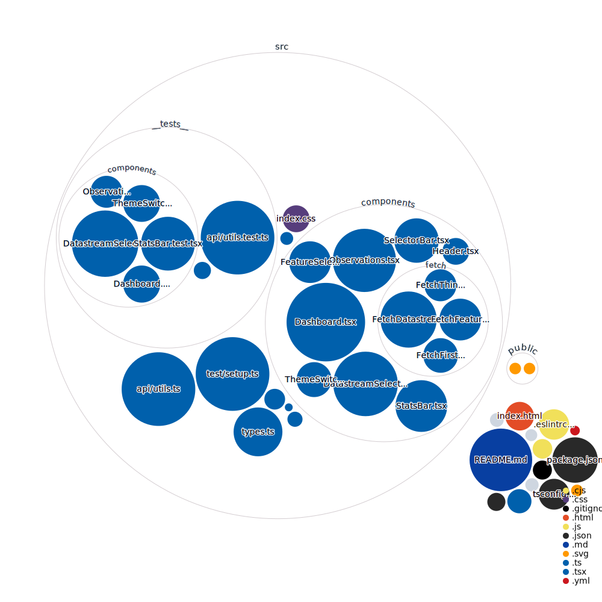

# GeoSense
A simple web app for exploring British Geological Survey (BGS) geoscientific IoT data

### Future Improvements:
- Testing
- Mermaid.js arch diagram for Readme
- Caching to reduce API calls (Next.js?)
- Add Google Maps API for location display ([3d Maps](https://developers.google.com/maps/documentation/javascript/3d-maps-getting-started?hl=en))

### API Structure
- `FeaturesOfInterest`: A feature about which observations are made
- `Things`: Real-world sensors that can be integrated into communication networks
- `Observations`: Individual measurements recorded at a given point in time
- `Datastreams`: The properties observed by a thing, and the type of sensor making the observations
- `ObservedProperty`: Dictionary of properties being observed

### Repo Visualisation
For more info head to: [Repo Visualizer](https://octo.github.com/projects/repo-visualization)

